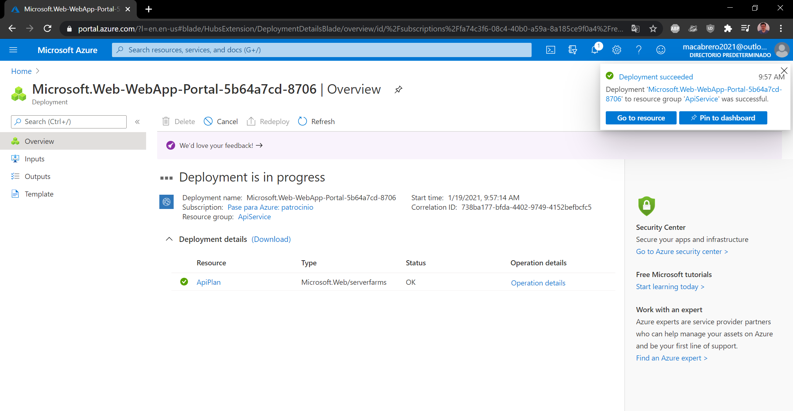

# Module 8: Creating a multi-tier solution by using services in Azure

### Nombres y apellidos:

Miguel Ángel Cabrero Luengo
### Fecha:
19/01/2021

### Resumen del Ejercicio:

#### Objetivo del ejercicio:
Crear una solución multi cliente utilizando servicios de Azure

#### Tareas realizadas:

- Ejecución de la aplicación

- Revisar la estructura de la aplicación de los principales elementos del código

- Añadir funcionalidad básica: Una página de test y obtención y visualización de animales.

### Exercise 1: Creating an Azure App Service resource by using a Docker container image

#### Task 1: Open the Azure portal

#### Task 2: Create a web app by using Azure App Service resource by using an httpbin container image

#### Task 3: Test the httpbin web application

### Dificultad o problemas presentados y cómo se resolvieron:
No ha presentado problemas.

