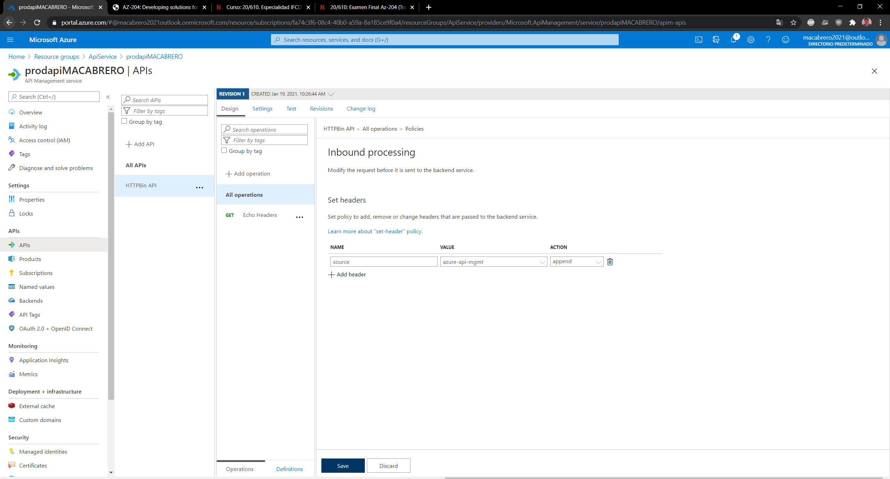
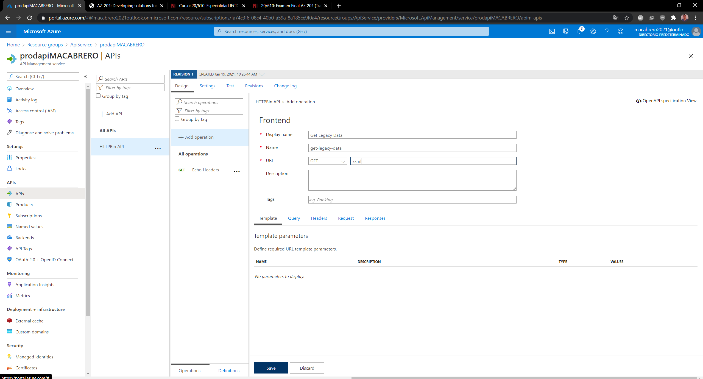
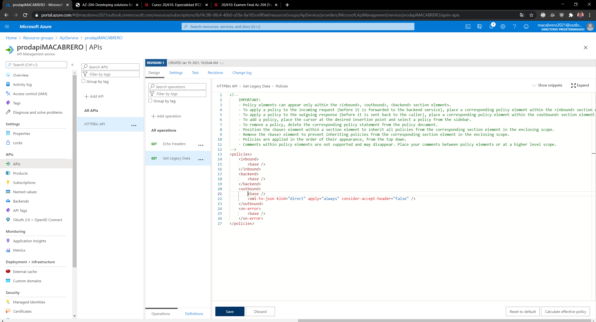

# Module 8: Creating a multi-tier solution by using services in Azure

### Nombres y apellidos:

Miguel Ángel Cabrero Luengo
### Fecha:
19/01/2021

### Resumen del Ejercicio:

#### Objetivo del ejercicio:
Crear una solución multi cliente utilizando servicios de Azure

### Exercise 2: Build an API proxy tier by using Azure API Management

#### Task 1: Create an API Management resource

#### Task 2: Define a new API

#### Task 3: Manipulate an API response

### Dificultad o problemas presentados y cómo se resolvieron:

No ha presentado problemas.