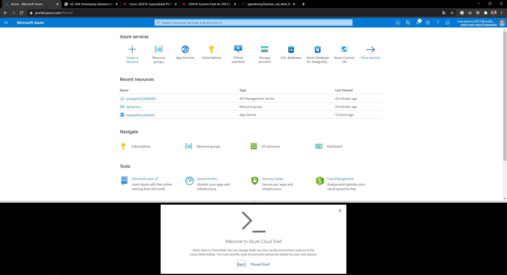
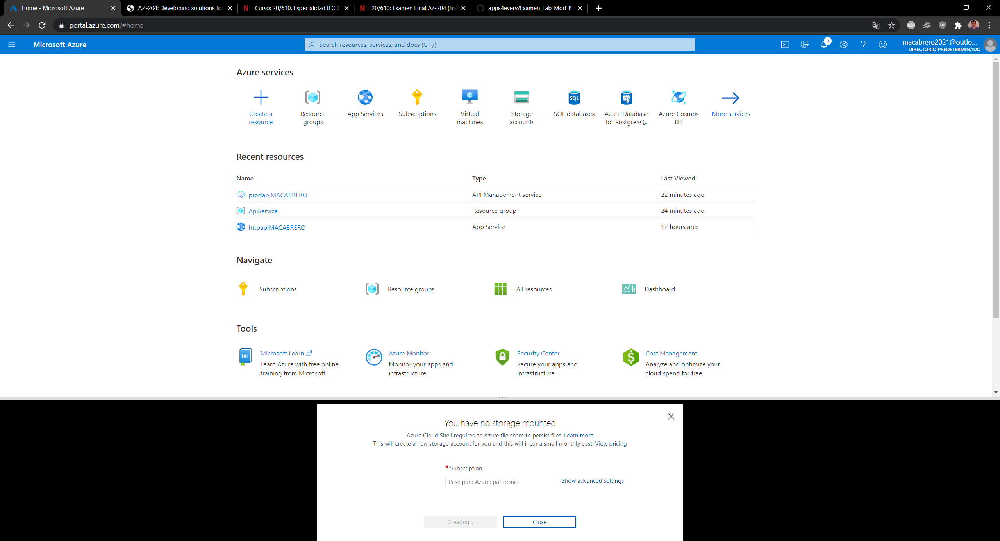
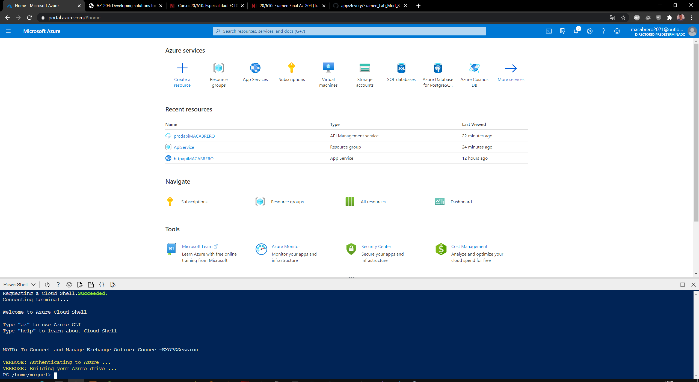
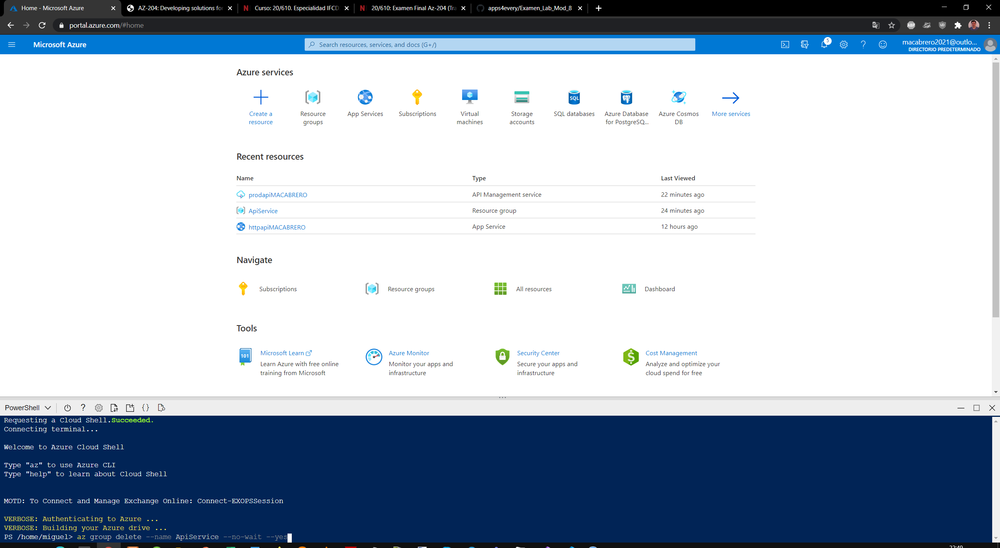

# Module 8: Creating a multi-tier solution by using services in Azure

### Nombres y apellidos:

Miguel Ángel Cabrero Luengo
### Fecha:
19/01/2021

### Resumen del Ejercicio:

#### Objetivo del ejercicio:
Crear una solución multi cliente utilizando servicios de Azure

### Exercise 3: Clean up your subscription

#### Task 1: Open Azure Cloud Shell

#### Task 2: Delete resource groups

### Dificultad o problemas presentados y cómo se resolvieron:

No ha presentado problemas.